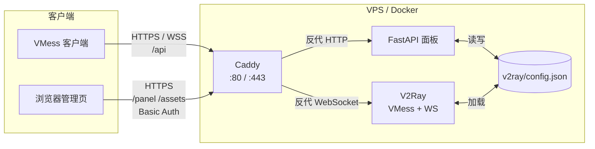
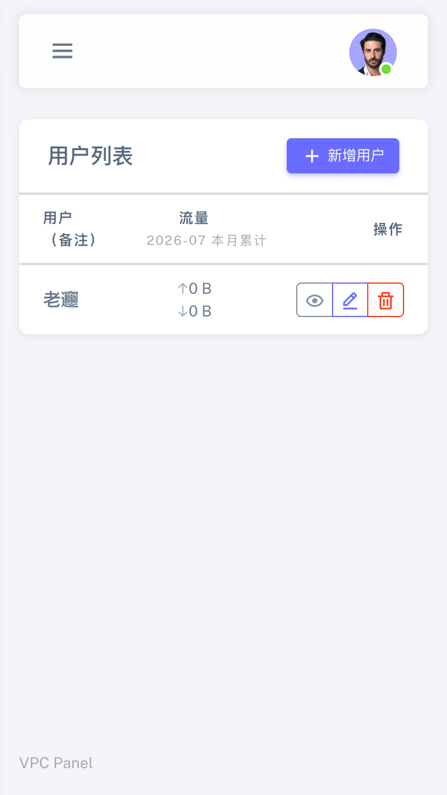
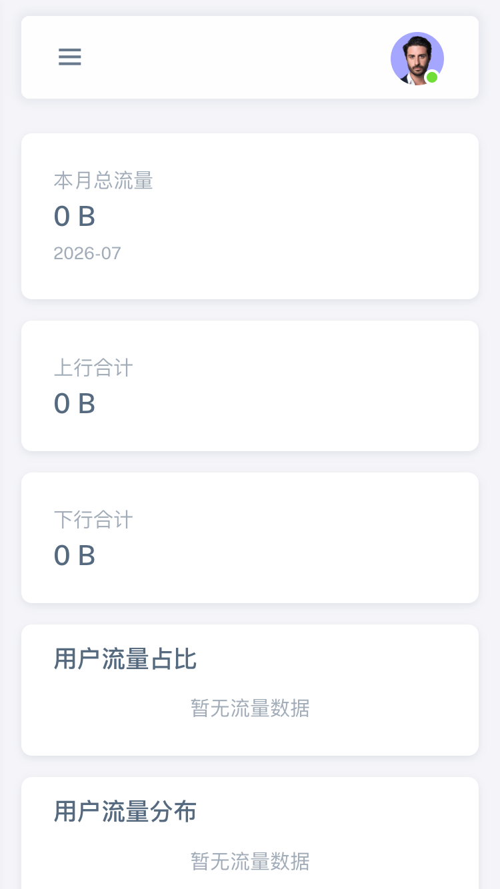
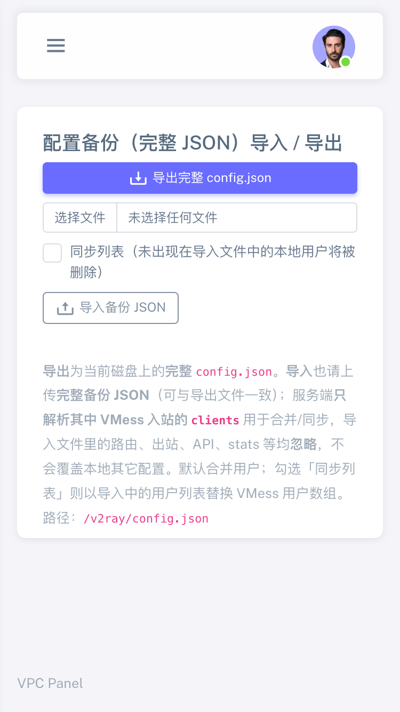

# 个人简易 VPN 代理（单节点）

Caddy 负责 HTTPS 与反代，V2Ray 提供 VMess，FastAPI 面板管理用户（无数据库，直接读写 `v2ray/config.json`）。

## 原理图



- **代理流量**：客户端经 Caddy 的 `/api`（WebSocket）连到 V2Ray。
- **管理面板**：`/panel` 与静态资源 `/assets` 由 Caddy Basic Auth 保护，再反代到面板。
- **配置存储**：面板与 V2Ray 共用 `v2ray/` 挂载目录，无数据库。

## 快速开始

准备工作: 需要将域名解析到当前 VPS IP，以便 Caddy 可以正常获取 HTTPS 证书。

1. 安装 Docker：`curl https://get.docker.com | sudo bash - && sudo usermod -aG docker $USER`
2. 初始化配置：`chmod +x scripts/init && ./scripts/init`
3. 启动服务：`docker compose up -d --build`
4. 打开管理页：`https://<你的域名>/panel/`（本地：`http://127.0.0.1/panel/`）

### 修改管理密码

```bash
chmod +x scripts/passwd
./scripts/passwd -p '你的强密码'
docker compose restart caddy
```

## 面板功能

- 表格管理 VMess 用户，支持导出 / 导入配置
- 导入时仅合并 VMess 用户列表，其它字段忽略
- 按月流量统计（数据保存在 `v2ray/panel_traffic_monthly.json`）

<p align="center">
  
  
  
</p>

<p align="center">
  <sub>用户列表 · 流量统计 · 配置备份</sub>
</p>

## 目录结构

- `web/` — FastAPI 面板
- `caddy/` — Caddy 配置（`Caddyfile` 由 `scripts/init` 生成）
- `v2ray/` — V2Ray 配置（`config.json` 运行时生成，不入库）

更多细节见 `docs/architecture.md`。

## 许可证

本项目采用 [MIT](LICENSE) 协议开源。

管理面板 UI 基于 [Sneat](https://github.com/themeselection/sneat-html-admin-template-free)（MIT），详见 `web/sneat-1.0.0/LICENSE.md`。
